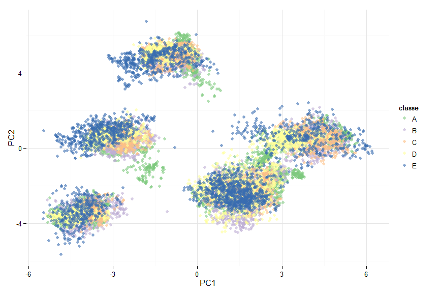
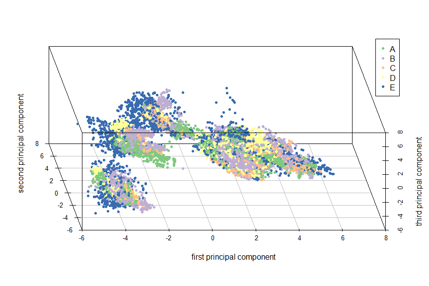

# Predicting type of Physical Exercises from Wearable Sensors
Jiri Hron  
Sunday, August 17, 2014  

# Synopsis

This paper was written as a course assignment for Coursera's class __Practical
Machine Learning__. Main goal of this assignment was to develop a statistical
model, which would be able to predict type of physical exercise being performed
by experiment participants based on the data collected from wearable motion
sensors attached to their bodies. In the following parts, a short description
of what pre-processing was used is given, followed by an elementary exploratory analysis. Last two chapters are then describing how the final model was
designed and providing out-of-sample estimate of the algorithm's accuracy.

# Data pre-processing


Data set used for this assignment was obtained as a subset of original
data [here][1]. Before approaching a model design, descriptive variables
(*X*, *user_name*, *raw_timestamp_part_1*, *raw_timestamp_part_2*,
*cvtd_timestamp*) and records containing aggregate statistics for larger time
window of previous rows in the data set (identified by variable value
`new_window == "yes"`) were removed.  

All remaining variables were tested for completeness, i.e. if there is at least
one valid value in the whole data set. Even this weak criterion and previously
described steps reduced variable column space from 160 to 53
dimensions (resp. from 159 to 52 if not response variable
`classe`).

Full data set of 19216 variables was divided into train and test sets,
with relative sizes of 0.75 and 0.25 for
both sets respectively.  

For purpose of exploratory analysis and model fitting, three versions of
model matrices were prepared:  

  1. **raw** - no transformation, original values  
  2. **normalized** - features were scaled and centered  
  3. **pca** - principal components transformations, preserving 95% of original
  variance

# Data exploration

Before exploration of sample space, we need to assure that our outcome 
variable `classe` (type of the activity being performed) is approximately
uniformly distributed or at least doesn't contain any very rare classes:


```
##    A    B    C    D    E 
## 4104 2789 2514 2361 2646
```

Now we explore if any of variables are unnecessary in terms of very low
variance. Such variables have very low predictive power and could cause
over-fitting of the model. As you can see on following figure, no such variables
were identified:


```
##                      freqRatio percentUnique zeroVar   nzv
## roll_belt                1.052        7.8049   FALSE FALSE
## pitch_belt               1.055       11.8496   FALSE FALSE
## yaw_belt                 1.058       12.5711   FALSE FALSE
## total_accel_belt         1.071        0.1943   FALSE FALSE
## gyros_belt_x             1.049        0.9158   FALSE FALSE
## gyros_belt_y             1.144        0.4579   FALSE FALSE
## gyros_belt_z             1.086        1.1378   FALSE FALSE
## accel_belt_x             1.082        1.1100   FALSE FALSE
## accel_belt_y             1.131        0.9574   FALSE FALSE
## accel_belt_z             1.082        2.0258   FALSE FALSE
## magnet_belt_x            1.004        2.1021   FALSE FALSE
## magnet_belt_y            1.159        2.0050   FALSE FALSE
## magnet_belt_z            1.036        3.0318   FALSE FALSE
## roll_arm                50.000       17.0390   FALSE FALSE
## pitch_arm               75.788       19.6337   FALSE FALSE
## yaw_arm                 33.784       18.5306   FALSE FALSE
## total_accel_arm          1.029        0.4510   FALSE FALSE
## gyros_arm_x              1.011        4.3569   FALSE FALSE
## gyros_arm_y              1.443        2.5323   FALSE FALSE
## gyros_arm_z              1.058        1.6581   FALSE FALSE
## accel_arm_x              1.054        5.3420   FALSE FALSE
## accel_arm_y              1.221        3.6909   FALSE FALSE
## accel_arm_z              1.118        5.2796   FALSE FALSE
## magnet_arm_x             1.081        9.1925   FALSE FALSE
## magnet_arm_y             1.033        5.9595   FALSE FALSE
## magnet_arm_z             1.036        8.6999   FALSE FALSE
## roll_dumbbell            1.115       86.0969   FALSE FALSE
## pitch_dumbbell           2.150       83.8282   FALSE FALSE
## yaw_dumbbell             1.163       85.3823   FALSE FALSE
## total_accel_dumbbell     1.039        0.2914   FALSE FALSE
## gyros_dumbbell_x         1.063        1.6304   FALSE FALSE
## gyros_dumbbell_y         1.249        1.8662   FALSE FALSE
## gyros_dumbbell_z         1.079        1.3737   FALSE FALSE
## accel_dumbbell_x         1.117        2.8514   FALSE FALSE
## accel_dumbbell_y         1.011        3.1913   FALSE FALSE
## accel_dumbbell_z         1.140        2.7612   FALSE FALSE
## magnet_dumbbell_x        1.072        7.4511   FALSE FALSE
## magnet_dumbbell_y        1.214        5.7236   FALSE FALSE
## magnet_dumbbell_z        1.000        4.5511   FALSE FALSE
## roll_forearm            11.887       13.1678   FALSE FALSE
## pitch_forearm           61.761       18.5306   FALSE FALSE
## yaw_forearm             15.778       12.5087   FALSE FALSE
## total_accel_forearm      1.122        0.4718   FALSE FALSE
## gyros_forearm_x          1.047        2.0119   FALSE FALSE
## gyros_forearm_y          1.083        5.0021   FALSE FALSE
## gyros_forearm_z          1.060        2.0119   FALSE FALSE
## accel_forearm_x          1.000        5.4183   FALSE FALSE
## accel_forearm_y          1.122        6.7712   FALSE FALSE
## accel_forearm_z          1.027        3.8643   FALSE FALSE
## magnet_forearm_x         1.069       10.1845   FALSE FALSE
## magnet_forearm_y         1.129       12.7307   FALSE FALSE
## magnet_forearm_z         1.023       11.2460   FALSE FALSE
```

Since our feature space is still 52-dimensional, we will use pca
transformation to get a basic insight into the aggregate information contained
in the training set. As already mentioned in previous text, principal components
were chosen in such way to preserve 95% of the variance in the data, which
yielded a total number of 27 principal directions.
Projection of data to the first two of them shows separation of data into
5 subgroups. However, this discernible pattern does not correspond to 
a distribution of `classe` variable pictured by color of the points.

 

If we involve the third principal component, we could see that clusters from
previous figure are forming oblong shapes on the next figure (third principal
component is added as a vertical axis).

 

Since PCA reduced the number of dimensions by 
51.9231% while still preserving 95%
of original variance, we will use principal components transformation in order
to speed up the learning process of our predictive algorithm.

To understand which of the original variables has the greatest influence on
first three principal directions, we can inspect coefficients used to obtain
each of the corresponding principal scores. In the next figure you can see
top 10 most influential coefficients for first principal direction ordered by
their absolute value:


```
##                      PC1      PC2      PC3
## accel_belt_y     -0.3129  0.05336 -0.11428
## accel_belt_z      0.3092 -0.12184  0.07764
## roll_belt        -0.2990  0.14525 -0.08411
## total_accel_belt -0.2963  0.12493 -0.10847
## accel_arm_y       0.2623 -0.13760 -0.11589
## accel_dumbbell_y  0.1925  0.16920 -0.01730
```

# Prediction model development

Purpose of following paragraphs is to design a best possible model, where best
means with highest prediction `Accuracy`.

## Design


We started by fitting two types of models, namely:

* Robust Regularized Linear Discriminant Analysis
* Support Vector Machines with RBF (Gaussian) Kernel

The former of those two models represents an algorithm preferring bias over
variance since it is using only linear fit, the latter one is on the contrary 
able to fit more general types of non-linear relationships between variables and
thus might tend to prefer variance. However both can be tuned by user provided
parameters, which can regularize the fit (increasing $\lambda$ for rrlda,
decreasing __C__ for SVM) or improve its flexibility (increasing __C__ for SVM,
decreasing $\lambda$ for rrlda).

## Tuning

For both of the models, adaptive 10-fold cross-validation was used so as to 
further decrease the training time needed and to improve predictive accuracy. 
Adaptive cross-validation is at the time of writing this paper relatively new
approach presented by [Kuhn (2014)][2] which dynamically reduces number of
candidate tuning parameters during cross-validation. Method used to rule-out
futile models used was the default one for _trainControl_ function used by
_caret_, which uses generalized least squares as a measure of each tuning
parameter's value "fruitfulness" and gets rid of any set of tuning parameters
that have significantly worse CV-error, than that of the best model at given
iteration (one-sided hypothesis test on 95% significant level was used to
determine such models). First 5 CV-iterations were performed with
full set of potential tuning parameters. Reduction of total number of candidate 
parameters was carried out at every following iteration, using average model 
error from all preceding iterations (refer to original paper for more details
about this method).  
Additional tuning parameters used for rrlda:


```
##   lambda   hp penalty
## 1   0.01 0.75      L2
## 2   0.10 0.75      L2
## 3   0.30 0.75      L2
## 4   1.00 0.75      L2
## 5   3.00 0.75      L2
## 6   6.00 0.75      L2
## 7  10.00 0.75      L2
## 8  20.00 0.75      L2
## 9  30.00 0.75      L2
```

The `hp` parameter is specifying proportion of available training examples for
model fitting which should be used for model fitting (robustness parameter),
`penalty` istype of the penalty to be used (we used L2 penalty which is more
suitable for environments where most of the predictors - in our case pca 
transforms - are expected to be significant predictors). $\lambda$ is 
the regularization parameter which we tried to find by cross-validation.  

Additional tuning parameters used for SVM:


```
##       C
## 1   0.1
## 2   1.0
## 3   3.0
## 4   5.0
## 5  10.0
## 6  15.0
## 7  20.0
## 8  30.0
## 9  35.0
## 10 40.0
## 11 45.0
## 12 50.0
## 13 60.0
```

The only tuning parameter for SVM was regularization constant __C__ 
(using C-svc type of SV). The $\sigma$ for Gaussian kernel was estimated
internally by method `kernlab::sigest` from by cross-validation.

In the next chapter, summarized results for both of the models are provided,
including the top parameters selected by cross-validation for both models.

# Evaluation

Following figure is showing confusion matrix for SVM model with RBF (Gaussian)
kernel comparing model predictions with our testing set of 4802
observations. Notice `Accuracy` line which is our final estimate for test error
accuracy of the best SVM model (best model had __C__ = 30).


```
## Confusion Matrix and Statistics
## 
##           Reference
## Prediction    A    B    C    D    E
##          A 1363    3    0    0    1
##          B   16  907    5    0    1
##          C    1    5  823    9    0
##          D    1    0   42  742    1
##          E    0    2    2   13  865
## 
## Overall Statistics
##                                         
##                Accuracy : 0.979         
##                  95% CI : (0.974, 0.983)
##     No Information Rate : 0.288         
##     P-Value [Acc > NIR] : <2e-16        
##                                         
##                   Kappa : 0.973         
##  Mcnemar's Test P-Value : NA            
## 
## Statistics by Class:
## 
##                      Class: A Class: B Class: C Class: D Class: E
## Sensitivity             0.987    0.989    0.944    0.971    0.997
## Specificity             0.999    0.994    0.996    0.989    0.996
## Pos Pred Value          0.997    0.976    0.982    0.944    0.981
## Neg Pred Value          0.995    0.997    0.988    0.995    0.999
## Prevalence              0.288    0.191    0.182    0.159    0.181
## Detection Rate          0.284    0.189    0.171    0.155    0.180
## Detection Prevalence    0.285    0.193    0.175    0.164    0.184
## Balanced Accuracy       0.993    0.992    0.970    0.980    0.996
```

Next, we assess performance of rrlda model. As you can see
on the following figure, `Accuracy` was not very good even for the best model
with parameters ($\lambda$,hp,penalty) = (0.01, 0.75, L2).


```
## Confusion Matrix and Statistics
## 
##           Reference
## Prediction   A   B   C   D   E
##          A 778 113 222 239  15
##          B 115 438 215 127  34
##          C 136  87 512  94   9
##          D  20 124 129 442  71
##          E  25 194 138 112 413
## 
## Overall Statistics
##                                         
##                Accuracy : 0.538         
##                  95% CI : (0.524, 0.552)
##     No Information Rate : 0.253         
##     P-Value [Acc > NIR] : <2e-16        
##                                         
##                   Kappa : 0.421         
##  Mcnemar's Test P-Value : <2e-16        
## 
## Statistics by Class:
## 
##                      Class: A Class: B Class: C Class: D Class: E
## Sensitivity             0.724   0.4582    0.421    0.436    0.762
## Specificity             0.842   0.8723    0.909    0.909    0.890
## Pos Pred Value          0.569   0.4715    0.611    0.562    0.468
## Neg Pred Value          0.914   0.8663    0.822    0.858    0.967
## Prevalence              0.224   0.1991    0.253    0.211    0.113
## Detection Rate          0.162   0.0912    0.107    0.092    0.086
## Detection Prevalence    0.285   0.1935    0.175    0.164    0.184
## Balanced Accuracy       0.783   0.6652    0.665    0.673    0.826
```

SVM model has shown a superior test error estimate and since its value
is very close to absolute optimum, there is no need for further tuning.  
`Accuracy` estimation for SVM model is also our final estimate for out-of-sample
error.

[1]: http://groupware.les.inf.puc-rio.br/har
[2]: http://arxiv.org/pdf/1405.6974v1.pdf "Kuhn (2014)"
